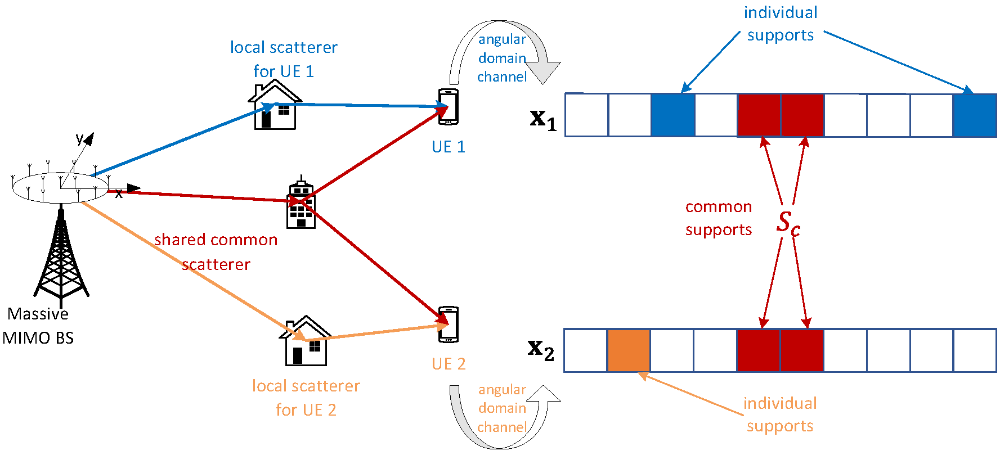
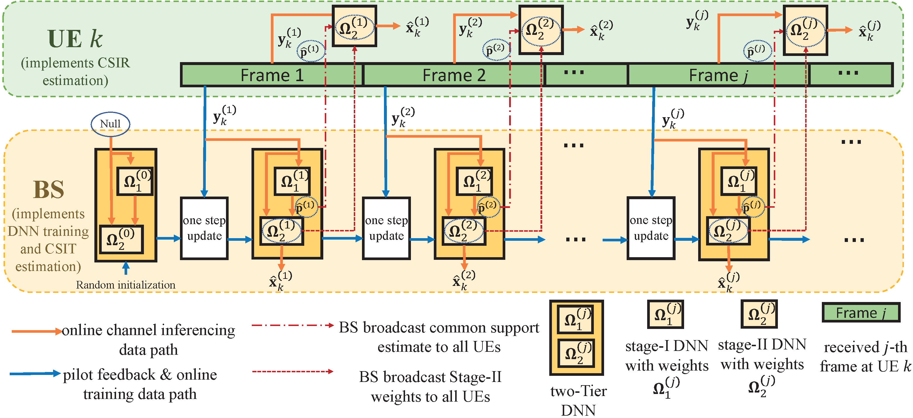
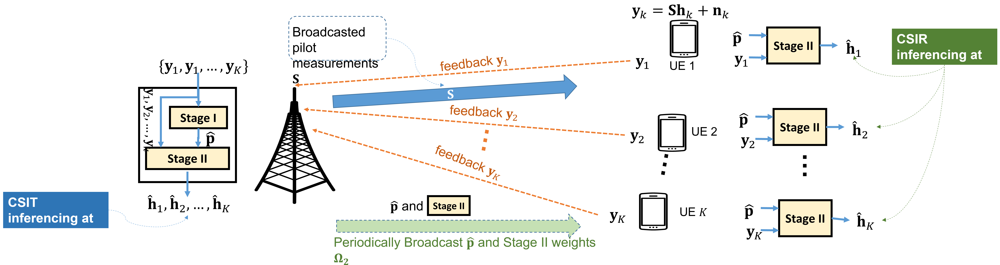

# Online DNN for MU MIMO
 This repository contains the source codes of the paper "Federated Online Deep Learning for CSIT and CSIR Estimation of FDD Multi-User Massive MIMO Systems", which is published in IEEE Transactions on Signal Processing (see https://ieeexplore.ieee.org/abstract/document/9765325).
 
In this paper, we propose a federated online training framework for deep neural network (DNN)-based channel estimation (CE) in frequency-division duplexing (FDD) multi-user massive multiple-input multiple-output (MU-MIMO) systems.

The proposed DNN consists of two stages, where Stage-I explores the partial common sparsity structure among the users, while Stage-II estimates the channel state information (CSI) with reduced pilot overhead leveraging the common support information provided by Stage-I.

The proposed two-tier DNN is trained online at the base station (BS) based on real-time pilot measurements distributively fed back from the users without the need of true channel labels, and the estimates for the CSI at the transmitter (CSIT) can be simultaneously generated in real-time. Meanwhile, the weights of Stage-II can be broadcasted to the users for real-time estimation of the CSI at the receiver (CSIR) at each user.

# Introduction of the codes
Run "main_two_stage.py" to implement the online training for the proposed two-stage DNN.
The script "MuMimoUtils.py" contains useful tool functions.

# Note
You may cite us by
@ARTICLE{9765325,
  author={Zheng, Xuanyu and Lau, Vincent},
  journal={IEEE Transactions on Signal Processing}, 
  title={Federated Online Deep Learning for CSIT and CSIR Estimation of FDD Multi-User Massive MIMO Systems}, 
  year={2022},
  volume={70},
  pages={2253-2266},
  doi={10.1109/TSP.2022.3171065}}